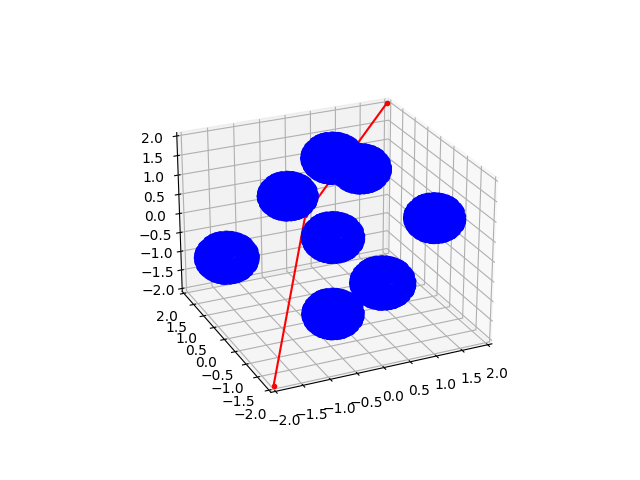
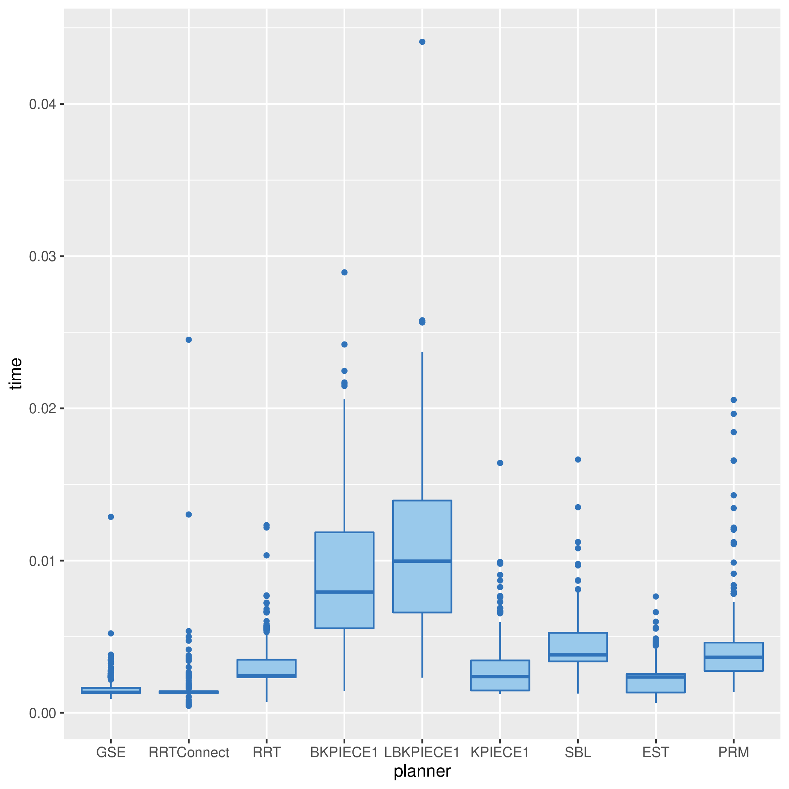

# Generalised Shape Expansion (GSE)

## Overview

Generalized Shape Expansion (GSE) is a sampling-based motion planning algorithm. Instead of performing collision checks to draw an edge between two vertices, our approach uses the information about the obstacles to compute a free space (termed as generalized shape) about the sampled point. This free space is then used to connect vertices. The connection with the vertices is not restricted to a fixed or decreasing connection radius as in case of other well established sampling based motion planning algorithms, thereby allowing us to generate feasible paths faster. Consequently, the number of iterations and edges to generate a feasible path are fewer compared to other algorithms. A sample feasible path generated using the GSE algoirthm is shown in the following figure.



## Dependancies
The project is based upon the *Open Motion Planning Library* (OMPL). OMPL is a fast and light weight library that consists of various state of the art sampling-based motion planning algorithms. It contains various tools that help expedite the development of motion planning algorithms

## Installation
To be able to run our code, Add the source files in a folder under ompl/src/ompl/geometric/planners/ . Install the OMPL folder and its dependancies by visiting https://github.com/ompl/ompl or follow the installation instructions provided in https://ompl.kavrakilab.org/installation.html. Another alternative is to run the following commands in order.

```shell
# Clone the central OMPL Repository
git clone https://github.com/ompl/ompl.git

# Clone the GSE repository
git clone git@github.com:nikhilprakash99/Generalised-Shape-Expansion-GSE.git GSE

# Copy source files to the OMPL repository
cp -R GSE/GSE ompl/src/ompl/geometric/planners     

# configure cmake
mkdir -p ompl/build/Release
cd ompl/build/Release
cmake ../..

# next step is optional, run if you want Python bindings for OMPL
make -j 4 update_bindings 

# replace "4" with the number of cores on your machine
make -j 4
```

Sample code on how to use the use the GSE algorithm for rigid body planning can be found [here](demos/RigidBodyPlanning.cpp)

## Comparison with other algorithms
We treat individual obstacles as mesh models or point cloud for all algorithms. For other algorithms under comparison, the Flexible Collision Library (FCL) library (https://github.com/flexible-collision-library/fcl) is used to perform collision checks. A sample comparison plot is shown in the following figure. Reference code for benchmarking can be found [here](demos/Benchmark.cpp)



## Using GSE with point cloud data
In real world applications, where the environment is usually represented as point cloud data (LiDAR sensor), the Point Cloud Library (PCL) (https://pointclouds.org/) can be used to segment the environment into spatially distinct obstacles. In particular, the pcl_segmentation library  can perform this task efficiently. Thereafter, the point cloud data for individual obstacles can be added in the GSE algorithm ('addObstacle' function). Readily available segmented point cloud dataset for some environments can be downloaded from https://projects.asl.ethz.ch/datasets/doku.php?id=home in CSV format .

## GSE in unknown 3D environments (3D-OGSE)
In unknown 3D environments, where the agent has local information about the obstacles in the form of point cloud data (LiDAR sensor), GSE can be used to generate feasible paths from the current position of the agent to the goal location. Once the agent reaches the boundary of the 'sensing shape' (intersection of generalized shape about the current position and the sensing region), the agent again triggers a replan taking again into account its local information. Initiaing a replan only when the agent reaches the boundary of the sensing shape (guaranteed to be a safe region) allows the agent to replan only when neccessary. Consequently, it saves computational load for the onboard sensors. Details of this approach can be found in https://arxiv.org/abs/2005.13229 .

## Citation

In case you use this work as an academic context, please cite as the following.
```
@article{zinage2020generalized,
  title={Generalized shape expansion-based motion planning in three-dimensional obstacle-cluttered environment},
  author={Zinage, Vrushabh Vijaykumar and Ghosh, Satadal},
  journal={Journal of Guidance, Control, and Dynamics},
  volume={43},
  number={9},
  pages={1781--1791},
  year={2020},
  publisher={American Institute of Aeronautics and Astronautics}
}

@inproceedings{zinage2019efficient,
  title={An efficient motion planning algorithm for uavs in obstacle-cluttered environment},
  author={Zinage, Vrushabh and Ghosh, Satadal},
  booktitle={2019 American Control Conference (ACC)},
  pages={2271--2276},
  year={2019},
  organization={IEEE}
}
```


## References

[1] Vrushabh.  V.  Zinage  and  S.  Ghosh,  “Generalized  shape  expansion-basedmotion planning in three-dimensional obstacle-cluttered environment,” Journal of Guidance, Control and Dynamics, vol. 43, no. 9, pp. 1781–1791, 2020

[2] V. Zinage and S. Ghosh, “An efficient motion planning algorithm for uavs in obstacle-cluttered environment,”  in 2019 American Control Conference (ACC). IEEE, 2019, pp. 2271–2276

## License

The Project is open source and is distributed under the BSD License
